<a href="https://sanskar-nanegaonkar.com" title="sanskar-nanegaonkar.com">
  <picture>
    <source media="(prefers-color-scheme: dark)" srcset="https://readme-typing-svg.demolab.com/?font=Fraunces&weight=600&size=32&pause=900&color=FFC371&center=true&vCenter=true&width=820&height=78&lines=Hi%2C+I'm+Sanskar+Nanegaonkar;AI+%2F+ML+Engineer;LLM+%C2%B7+Agents+%C2%B7+RAG+%C2%B7+Evals+%C2%B7+Multimodal;Shipping+production+LLM+systems+end+to+end" />
    
  </picture>
</a>

<strong>Production LLM, agentic, multimodal, and clinical ML, shipped end to end.</strong>

Enterprise RAG for NTT DATA &nbsp;·&nbsp; voice agents across 1,000+ calls &nbsp;·&nbsp; the clinical model behind an FDA Breakthrough Device application.
 IIT Hyderabad '22 &nbsp;·&nbsp; Bengaluru, India &nbsp;·&nbsp; open to US relocation (transferable H1B).

## About

I turn frontier models into systems that survive contact with real users, real data, and real regulation. Four-plus years at I'mbesideyou, from clinical ML into applied LLM systems. I'm comfortable across the whole stack, from data and training through evals, post-training, and deployment.

- **RAG and retrieval** &nbsp;:&nbsp; multi-tenant retrieval, hybrid search, cross-encoder reranking, parent-document retrieval; 1,000+ enterprise policies indexed for NTT DATA
- **Agentic systems** &nbsp;:&nbsp; LangGraph orchestration, tool use, Pydantic structured outputs, multi-agent pipelines; SOP generation used across 3+ orgs by 100+ operators
- **Evals and observability** &nbsp;:&nbsp; LLM-as-judge, regression gates, RAGAS, Langfuse
- **Multimodal and clinical ML** &nbsp;:&nbsp; VLMs, early fusion, production pipelines; 83% depression-severity accuracy across 350+ patients, the model behind an FDA Breakthrough Device application

## Tech I reach for

**LLM and GenAI**
 

**AI / ML**
 

**Backend and Infra**
 

## Contributions

<picture>
  <source media="(prefers-color-scheme: dark)" srcset="https://raw.githubusercontent.com/02san02/02san02/output/github-contribution-grid-snake-dark.svg" />
  
</picture>

---

<i><a href="https://sanskar-nanegaonkar.com">sanskar-nanegaonkar.com</a></i>

